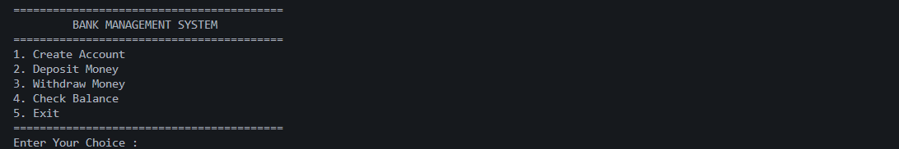
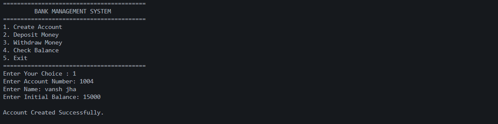
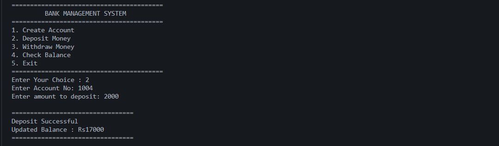
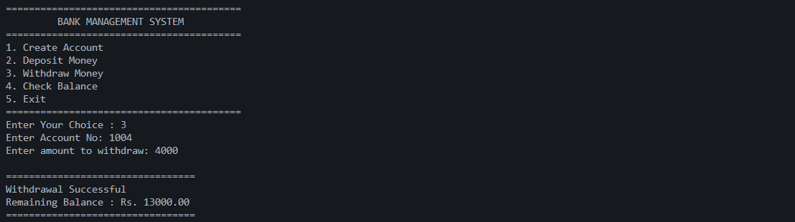
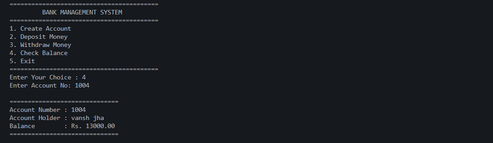

# 🏦 Bank Management System

<p align="center">
  
  
  
  
</p>

---

## 📌 Overview

A **console-based Bank Management System** developed in **C++** using **Object-Oriented Programming (OOP)** and **Binary File Handling**.

This project allows users to securely manage bank accounts by creating new accounts, depositing money, withdrawing money, and checking account balances. Data is stored permanently using binary files.

---

# ✨ Features

- ✅ Create New Account
- ✅ Deposit Money
- ✅ Withdraw Money
- ✅ Check Balance
- ✅ Binary File Storage
- ✅ Duplicate Account Number Check
- ✅ Input Validation
- ✅ Simple Menu Driven Interface

---

# 🛠️ Technologies Used

| Technology | Purpose |
|------------|---------|
| C++ | Programming Language |
| OOP | Object-Oriented Design |
| File Handling | Permanent Data Storage |
| Binary Files | Save Account Records |

---

# 📂 Project Structure

```
BANK-MANAGEMENT
│
├── BankManagementSystem.cpp
├── README.md
├── images
│   ├── menu.png
│   ├── create-account.png
│   ├── deposit.png
│   ├── withdraw.png
│   └── balance.png
└── .gitignore
```

---

# 📸 Project Preview

## 🏠 Main Menu



---

## ➕ Create Account



---

## 💰 Deposit Money



---

## 💸 Withdraw Money



---

## 📊 Check Balance



---

# ⚙️ How to Run

### Clone Repository

```bash
git clone https://github.com/v4nshjha-tech/BANK-MANAGEMENT.git
```

### Compile

```bash
g++ BankManagementSystem.cpp -o BankManagementSystem
```

### Run

```bash
./BankManagementSystem
```

---

# 🚀 Future Improvements

- Login Authentication
- Password Protected Accounts
- Money Transfer
- Transaction History
- Delete Account
- Update Account Details
- GUI Version

---

# 👨‍💻 Author

**Vansh Jha**

🎓 CSIT Student

💻 C++ | HTML | CSS | PHP | MySQL

🌱 Currently Learning React

🔗 GitHub

https://github.com/v4nshjha-tech

---

## ⭐ Support

If you like this project, don't forget to **Star ⭐ the repository**.